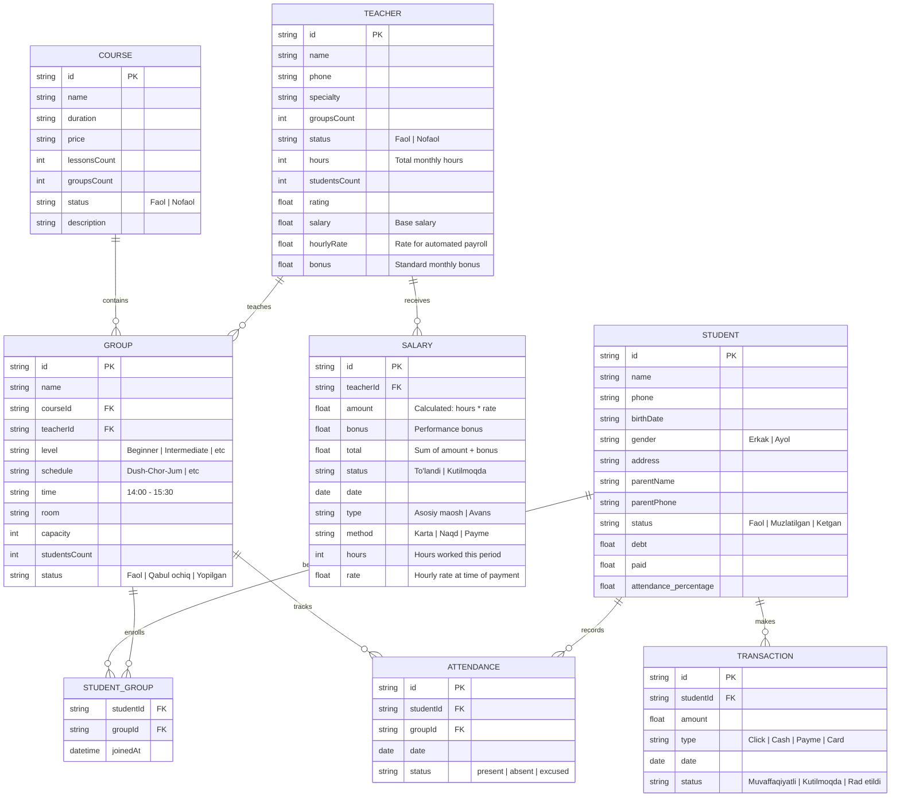

# EduSaaS Database Design

This document outlines the database architecture for the EduSaaS platform, including entities, fields, and relationships.

## Entity Relationship Diagram (ERD)

## Core Logic

### 1. Automated Payroll
The system calculates `SALARY.amount` by multiplying `TEACHER.hours` by `TEACHER.hourlyRate`. The `SALARY.bonus` is initialized from `TEACHER.bonus` but can be adjusted manually by admins.

### 2. Group-Based Attendance
Attendance is recorded per student per group. This allows the platform to filter the attendance list so that only students enrolled in the selected group are displayed during marking.

### 3. Financial Tracking
- **Income**: Tracked via `TRANSACTION` linked to `STUDENT`.
- **Expense**: Tracked via `SALARY` linked to `TEACHER`.
- **Balance**: Calculated as `Income - Expense`.
